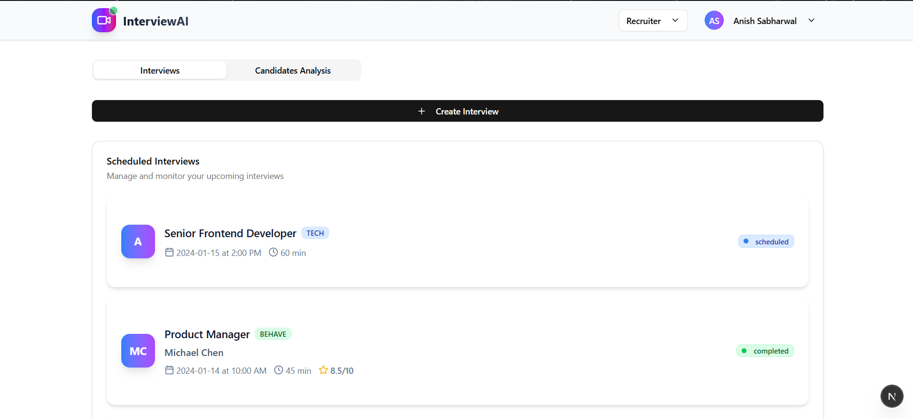
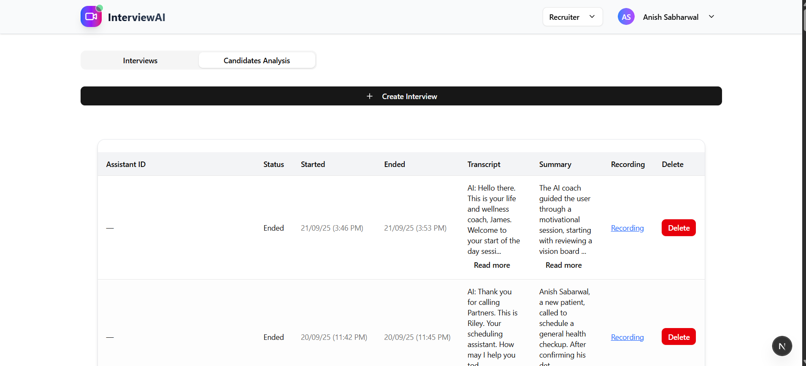
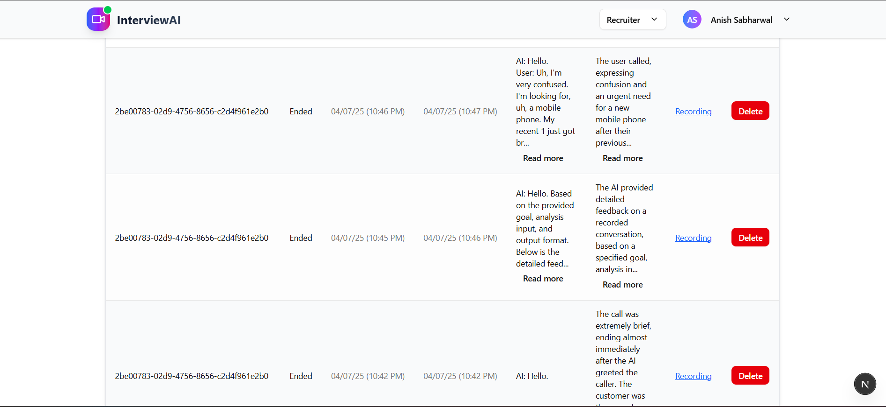
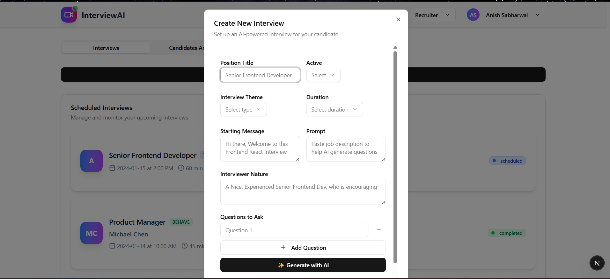
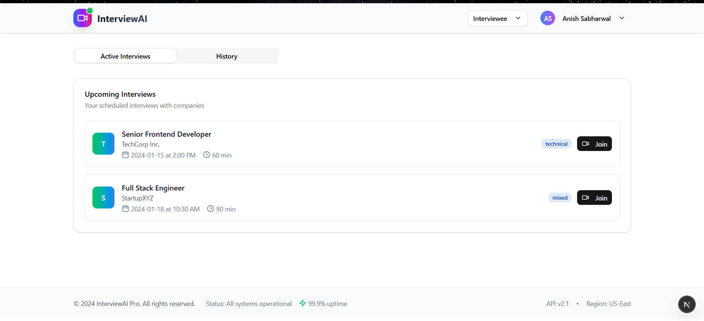
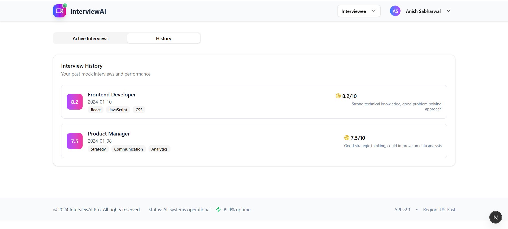
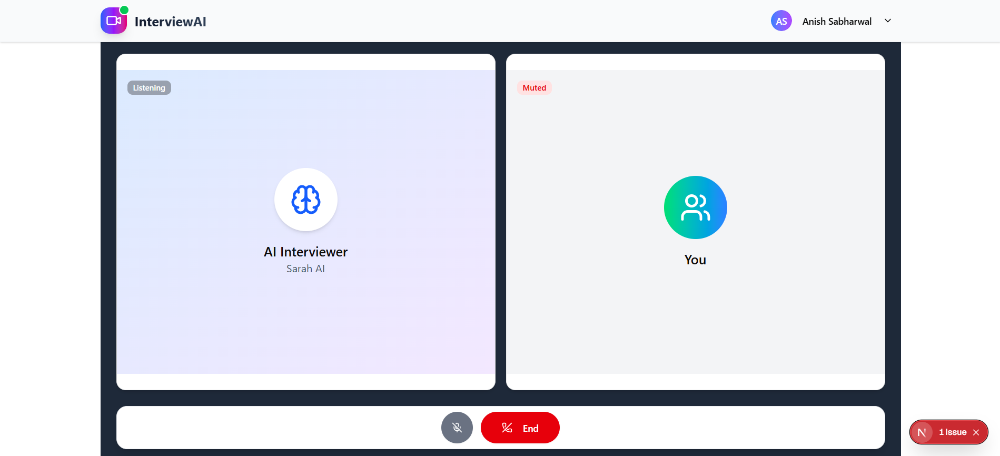
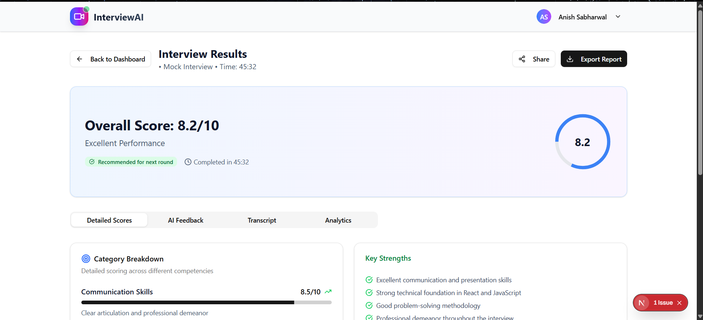
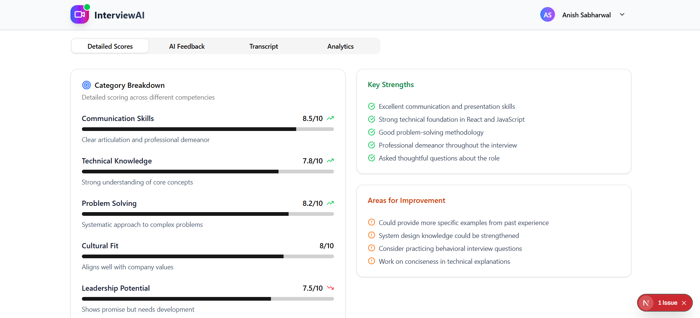

# AI Recruiter App:

- Nextjs Frontend Webapp (Frontend Client connected with Vapi for AI Calls)
- Also allows recruiters to create interviews takens by AI Interviewer and it analyses and gives a report which can be viewed by the recruiter (Core Idea)
- Has 2 Dashboard:
  
  1. Recruiter

     
  2. Interviewee dashboard

